# Generating high-quality symbolic music using fine-grained discriminators

## Abstract

Existing symbolic music generation methods utilize discriminator to distinguish AI-generated music from human-composed one based on a global perception. However, considering the complexity of information in music, such as rhythm and melody, a single discriminator cannot fully reflect the differences in these two primary dimensions of music. In this work, we propose to decouple the melody and rhythm from music, and design corresponding fine-grained discriminator to tackle the aforementioned issue. Specifically, equipped with a pitch augmentation strategy, the melody discriminator discerns the melody variations presented by the generated samples. By contrast, the rhythm discriminator, enhanced with bar-level relative positional encoding, focuses on the velocity of generated notes. Such a design allows the generator to be more clearly aware of which aspect should be adjusted of the generated music, rendering a ease to mimic human-composed music. Experimental results on the POP909 benchmark demonstrate the favorable performance of the proposed method compared to several state-of-the-art methods in terms of both objective and subjective metrics.and subjective  metrics. 

## The theoretical foundation in the field of music perception

> **Rhythm and melody are the 2 primary dimensions of music. They are interesting psychologically because simple, well-defined units combine to form highly complex and varied patterns.** 
Rhythm is the pattern of sound, silence, and emphasis in a song. It’s what makes music move and flow. It involves elements like beat, meter, tempo, and syncopation.
Melody, on the other hand, is a sequence of single notes that make up your main thematic material. It’s the part of a song that you often find yourself humming or whistling.
Together, rhythm and melody give music its unique character and beauty. They’re like the heartbeat and voice of a song, each contributing to its depth and expression.

## The main structure of the proposed method

## The Generated Examples of ours and other benchmark models
Notice: All the sample in the same row take the same condition music piece as input or the prefix sequence.
All generated MIDI were rendered to audio(.mp3) using MuseScore General SoundFont.

| ID  | Condition                                                 | Ground Truth                                              | Ours                                                      | Music Transformer                                         | WGAN                                                      | Theme Transformer                                         |
| --- | --------------------------------------------------------- | --------------------------------------------------------- | --------------------------------------------------------- | --------------------------------------------------------- | --------------------------------------------------------- | --------------------------------------------------------- |
| 883 | <audio src="music_sample/Condition/883_theme.mp3" controls title="Title"></audio>|<audio src="music_sample/GT/GT_883.mp3" controls title="Title"></audio>|<audio src="music_sample/Ours/output_ours_883.mp3" controls title="Title"></audio>|<audio src="music_sample/Music%20Transformer/output_musictransformer_883.mp3" controls title="Title"></audio>|<audio src="music_sample/WGAN/output_WGAN_883.mp3" controls title="Title"></audio>|<audio src="music_sample/Theme%20Transformer/output_theme_883.mp3" controls title="Title"></audio>|
| 888 |<audio src="music_sample/Condition/888_theme.mp3" controls title="Title"></audio>|<audio src="music_sample/GT/GT_888.mp3" controls title="Title"></audio>|<audio src="music_sample/Ours/output_ours_888.mp3" controls title="Title"></audio>|<audio src="music_sample/Music%20Transformer/output_musictransformer_888.mp3" controls title="Title"></audio>|<audio src="music_sample/WGAN/output_WGAN_888.mp3" controls title="Title"></audio>|<audio src="music_sample/Theme%20Transformer/output_theme_888.mp3" controls title="Title"></audio>|
| 896 |<audio src="music_sample/Condition/896_theme.mp3" controls title="Title"></audio>|<audio src="music_sample/GT/GT_896.mp3" controls title="Title"></audio>|<audio src="music_sample/Ours/output_ours_896.mp3" controls title="Title"></audio>|<audio src="music_sample/Music%20Transformer/output_musictransformer_896.mp3" controls title="Title"></audio>|<audio src="music_sample/WGAN/output_WGAN_896.mp3" controls title="Title"></audio>|<audio src="music_sample/Theme%20Transformer/output_theme_896.mp3" controls title="Title"></audio>|
| 897 |<audio src="music_sample/Condition/897_theme.mp3" controls title="Title"></audio>|<audio src="music_sample/GT/GT_897.mp3" controls title="Title"></audio>|<audio src="music_sample/Ours/output_ours_897.mp3" controls title="Title"></audio>|<audio src="music_sample/Music%20Transformer/output_musictransformer_897.mp3" controls title="Title"></audio>|<audio src="music_sample/WGAN/output_WGAN_897.mp3" controls title="Title"></audio>|<audio src="music_sample/Theme%20Transformer/output_theme_897.mp3" controls title="Title"></audio>|
| 898 |<audio src="music_sample/Condition/898_theme.mp3" controls title="Title"></audio>|<audio src="music_sample/GT/GT_898.mp3" controls title="Title"></audio>|<audio src="music_sample/Ours/output_ours_898.mp3" controls title="Title"></audio>|<audio src="music_sample/Music%20Transformer/output_musictransformer_898.mp3" controls title="Title"></audio>|<audio src="music_sample/WGAN/output_WGAN_898.mp3" controls title="Title"></audio>|<audio src="music_sample/Theme%20Transformer/output_theme_898.mp3" controls title="Title"></audio>|
| 905 |<audio src="music_sample/Condition/905_theme.mp3" controls title="Title"></audio>|<audio src="music_sample/GT/GT_905.mp3" controls title="Title"></audio>|<audio src="music_sample/Ours/output_ours_905.mp3" controls title="Title"></audio>|<audio src="music_sample/Music%20Transformer/output_musictransformer_905.mp3" controls title="Title"></audio>|<audio src="music_sample/WGAN/output_WGAN_905.mp3" controls title="Title"></audio>|<audio src="music_sample/Theme%20Transformer/output_theme_905.mp3" controls title="Title"></audio>|
| 907 | <audio src="music_sample/Condition/907_theme.mp3" controls title="Title"></audio>|<audio src="music_sample/GT/GT_907.mp3" controls title="Title"></audio>|<audio src="music_sample/Ours/output_ours_907.mp3" controls title="Title"></audio>|<audio src="music_sample/Music%20Transformer/output_musictransformer_907.mp3" controls title="Title"></audio>|<audio src="music_sample/WGAN/output_WGAN_907.mp3" controls title="Title"></audio>|<audio src="music_sample/Theme%20Transformer/output_theme_907.mp3" controls title="Title"></audio>|

## Visualizing experimental results
The note's pitch and velocity distribution of generated music from ours and other benchmark models.
Notice: All distributions have been approximated to a normal distribution using the Seaborn library.

1. The global distribution camparison.
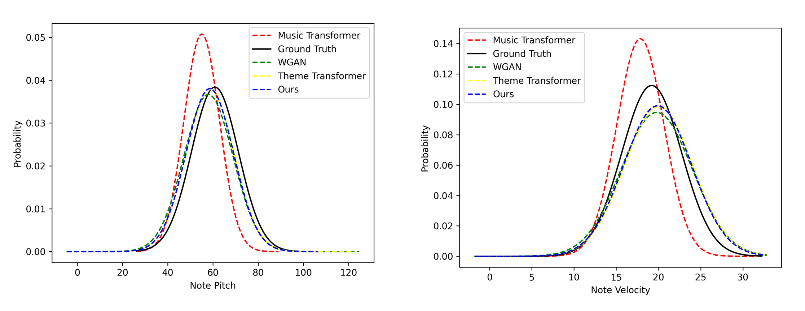

2. Case study
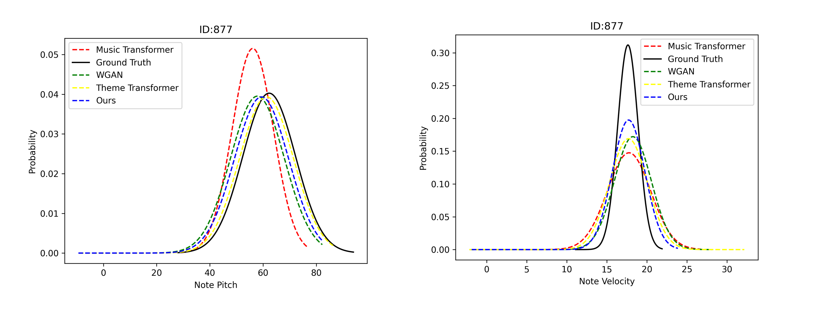
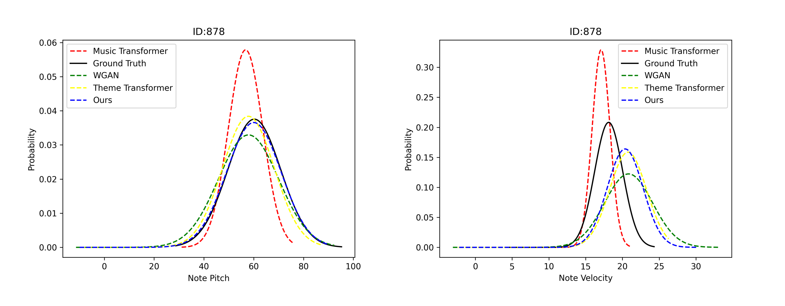
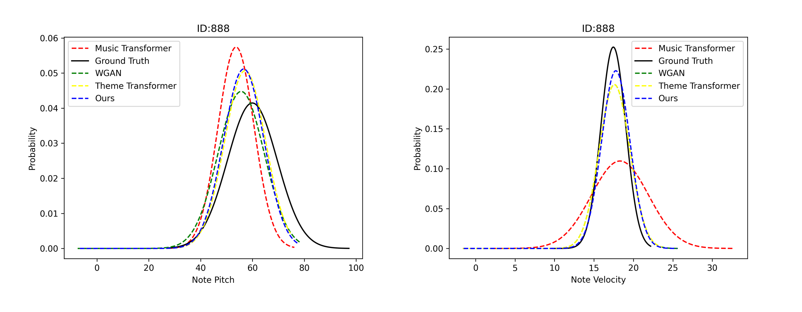
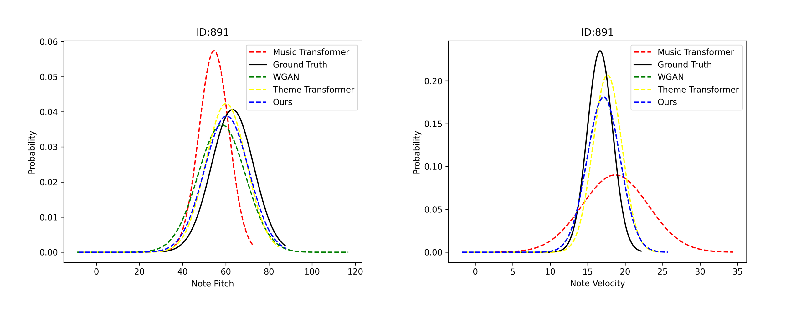
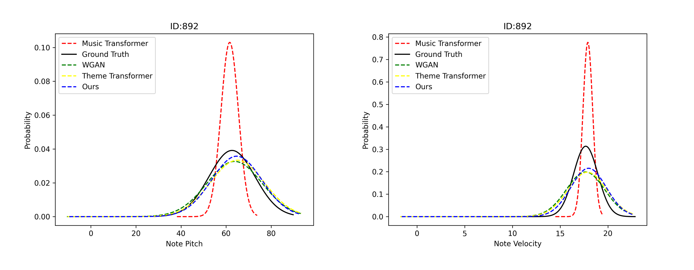
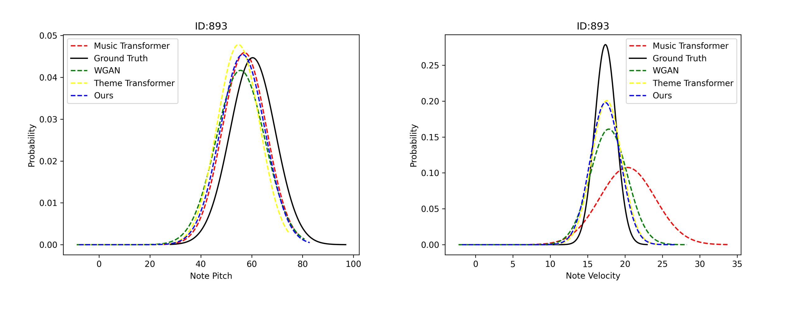
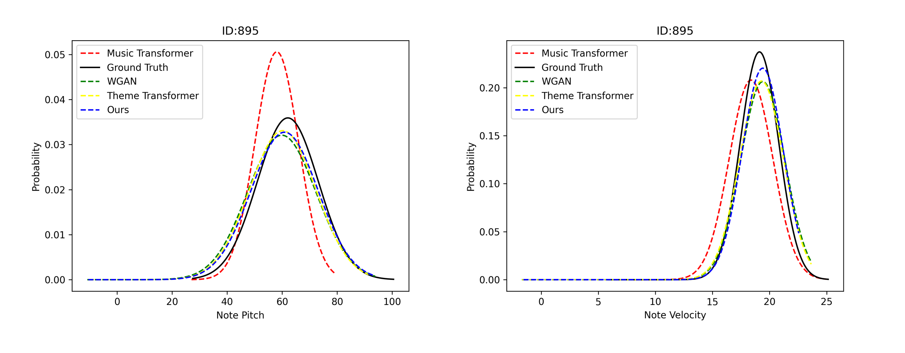
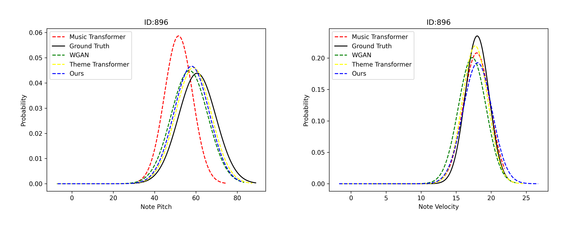
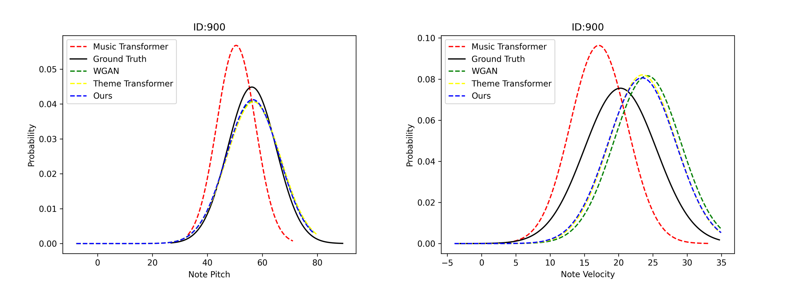
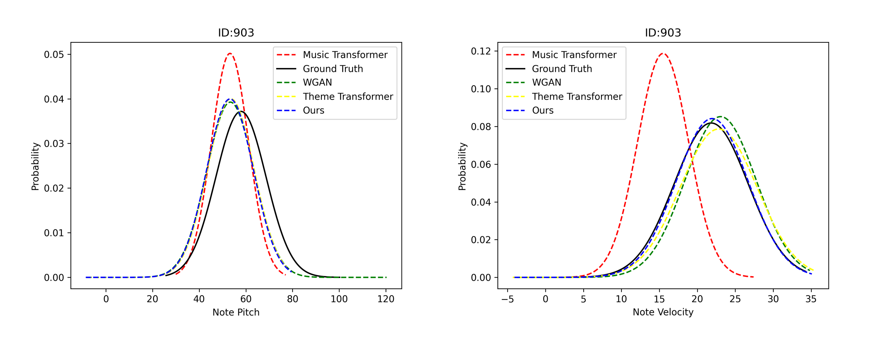
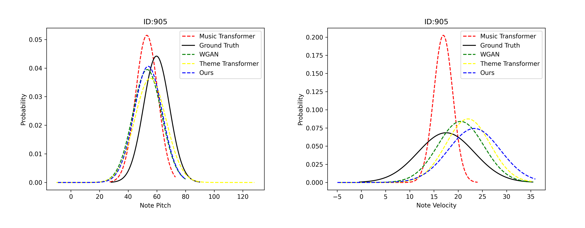
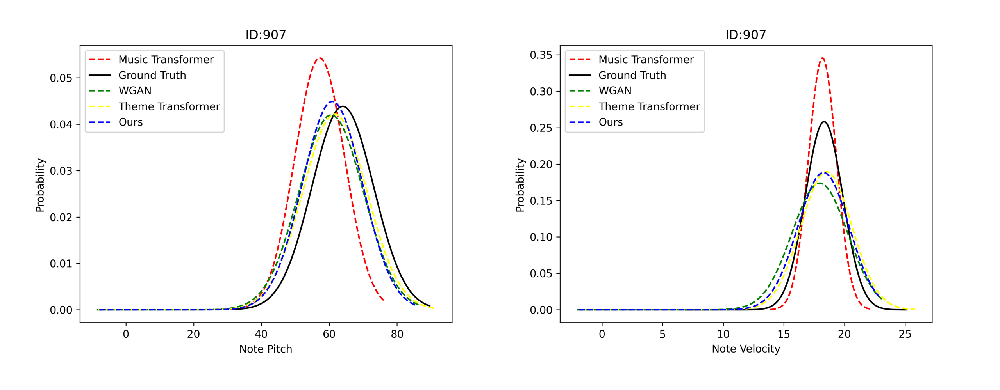